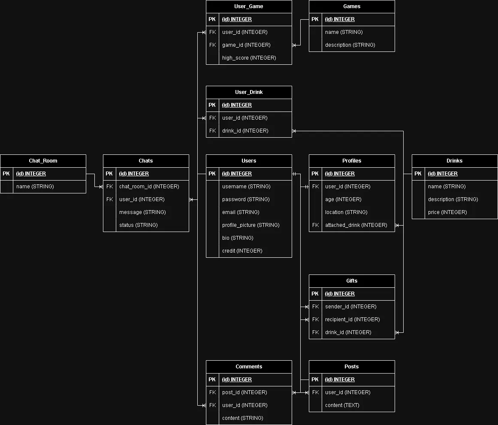

# Table

## ERD diagram

## User table

Stores all the users.

| Column          | Type         | Description
| --------------- | ------------ | -----------------------
| user_id         | SERIAL       | Unique identifier for the user, Auto-increment
| username        | VARCHAR(255) | Required, Unique username, characters between 3 and 255
| password        | VARCHAR(255) | Required, Hashed and salted password, characters between 3 and 255
| email           | VARCHAR(255) | Required, Unique email, Format: isEmail
| profile_picture | VARCHAR(255) | URL to imagekit database, Format: isUrl
| bio             | VARCHAR(255) | User's biography or description, characters between 3 and 255
| credit          | INTEGER      | Earn credit from playing games, Default 0
| created_at      | TIMESTAMP    | Date and time when the user was created, Default current timestamp
| updated_at      | TIMESTAMP    | Date and time when the user was last updated, Default current timestamp

## Drink table

Drinks are stickers that you can add to your profile, obtained by earning credits playing games.

Stores all the drinks; the number is fixed from seeding.

| Column      | Type         | Description
| ----------- | ------------ | -----------------------
| drink_id    | SERIAL       | Unique identifier for the drink, Auto-increment
| name        | VARCHAR(255) | Drink name
| description | VARCHAR(255) | Drink description
| price       | INTEGER      | Price in credits, Default 0
| created_at  | TIMESTAMP    | Date and time when the drink was added, Default current timestamp
| updated_at  | TIMESTAMP    | Date and time when the drink information was last updated, Default current timestamp

## Game table

Stores all the games; the number is fixed from seeding.

| Column      | Type         | Description
| ----------- | ------------ | -----------------------
| game_id     | SERIAL       | Unique identifier for the game, Auto-increment
| name        | VARCHAR(255) | Game name
| description | VARCHAR(255) | Game description
| created_at  | TIMESTAMP    | Date and time when the game was added, Default current timestamp
| updated_at  | TIMESTAMP    | Date and time when the game information was last updated, Default current timestamp

## Chat_Room table

Stores all the chat rooms; the number is fixed from seeding.

| Column        | Type         | Description
| ------------- | ------------ | -----------------------
| chat_room_id  | SERIAL       | Unique identifier for the chat room, Auto-increment
| name          | VARCHAR(255) | Chat room name
| created_at    | TIMESTAMP    | Date and time when the chat room was created, Default current timestamp
| updated_at    | TIMESTAMP    | Date and time when the chat room information was last updated, Default current timestamp

## Profile table

One user can have one profile.

| Column         | Type         | Description
| -------------- | ------------ | -----------------------
| profile_id     | SERIAL       | Unique identifier for the profile, Auto-increment
| user_id        | INTEGER      | Required, references the associated user (foreign key)
| age            | INTEGER      | User's age, minimum value is 1, CHECK(age >= 1)
| location       | VARCHAR(255) | User's location
| attached_drink | INTEGER      | References the associated drink (foreign key)
| created_at     | TIMESTAMP    | Date and time when the profile was created, Default current timestamp
| updated_at     | TIMESTAMP    | Date and time when the profile information was last updated, Default current timestamp

## Chat table

Stores the connection, between user sender and chat room.

| Column         | Type         | Description
| -------------- | ------------ | -----------------------
| chat_id        | SERIAL       | Unique identifier for the chat message, Auto-increment
| chat_room_id   | INTEGER      | Required, references the associated chat room (foreign key)
| user_id        | INTEGER      | Required, references the user (sender) (foreign key)
| message        | VARCHAR(255) | Required, message content
| status         | VARCHAR(255) | Required, message status (Sent? Read?), Default 'Sent'
| created_at     | TIMESTAMP    | Date and time when the chat message was created, Default current timestamp
| updated_at     | TIMESTAMP    | Date and time when the chat message information was last updated, Default current timestamp

## Post table

One user can have many posts.

| Column     | Type         | Description
| ---------- | ------------ | -----------------------
| post_id    | SERIAL       | Unique identifier for the post, Auto-increment
| user_id    | INTEGER      | Required, references the associated user (foreign key)
| content    | TEXT         | Required, post content
| created_at | TIMESTAMP    | Date and time when the post was created, Default current timestamp
| updated_at | TIMESTAMP    | Date and time when the post information was last updated, Default current timestamp

## Comment table

Stores the connection, between user sender and post.

| Column      | Type         | Description
| ----------- | ------------ | -----------------------
| comment_id  | SERIAL       | Unique identifier for the comment, Auto-increment
| post_id     | INTEGER      | Required, references the associated post (foreign key)
| user_id     | INTEGER      | Required, references the user making the comment (foreign key)
| content     | VARCHAR(255) | Required, comment content
| created_at  | TIMESTAMP    | Date and time when the comment was created, Default current timestamp
| updated_at  | TIMESTAMP    | Date and time when the comment information was last updated, Default current timestamp

## User_Game table

Stores the connection, between user and game.

| Column         | Type         | Description
| -------------- | ------------ | -----------------------
| user_game_id   | SERIAL       | Unique identifier for the user-game connection, Auto-increment
| user_id        | INTEGER      | Required, references the associated user (foreign key)
| game_id        | INTEGER      | Required, references the associated game (foreign key)
| high_score     | INTEGER      | Default 0, user's high score in the game
| created_at     | TIMESTAMP    | Date and time when the user-game connection was created, Default current timestamp
| updated_at     | TIMESTAMP    | Date and time when the user-game connection information was last updated, Default current timestamp

## Gift table

Stores the connection, between user sender and user receiver. A gift is a drink.

| Column        | Type         | Description
| ------------- | ------------ | -----------------------
| gift_id       | SERIAL       | Unique identifier for the gift, Auto-increment
| sender_id     | INTEGER      | Required, references the user sending the gift (foreign key)
| recipient_id  | INTEGER      | Required, references the user receiving the gift (foreign key)
| drink_id      | INTEGER      | Required, references the associated drink (foreign key)
| created_at    | TIMESTAMP    | Date and time when the gift was created, Default current timestamp
| updated_at    | TIMESTAMP    | Date and time when the gift information was last updated, Default current timestamp

## User_Drink table

Stores the connection, between user and drink.

| Column         | Type         | Description
| -------------- | ------------ | -----------------------
| user_drink_id  | SERIAL       | Unique identifier for the user-drink connection, Auto-increment
| user_id        | INTEGER      | Required, references the user owning the drink (foreign key)
| drink_id       | INTEGER      | Required, references the associated drink (foreign key)
| created_at     | TIMESTAMP    | Date and time when the user-drink connection was created, Default current timestamp
| updated_at     | TIMESTAMP    | Date and time when the user-drink connection information was last updated, Default current timestamp

